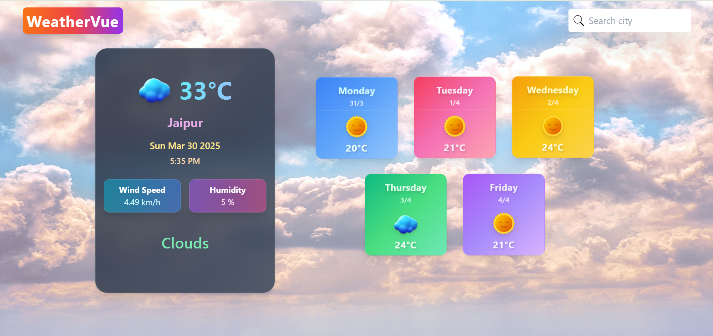
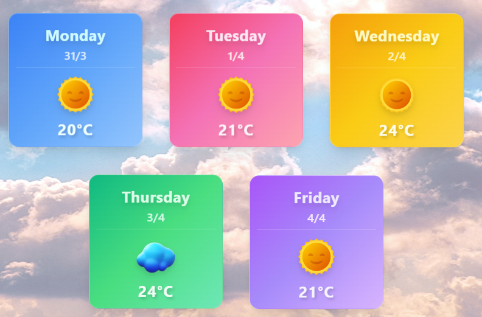
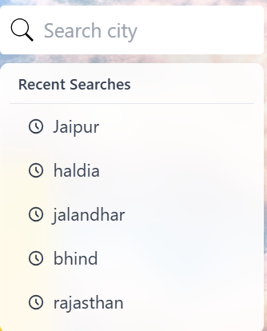
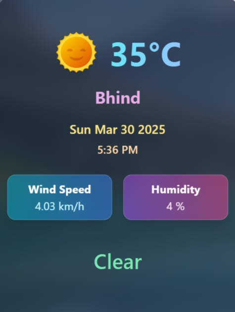

# WeatherVue 🌤️

A modern weather application built with React that provides real-time weather information and 5-day forecast with an intuitive user interface.



## ✨ Key Features

- **Real-time Weather Data** for any city worldwide
- **5-Day Weather Forecast**
- **Smart Search System**:
  - City search with auto-suggestions
  - Recent search history (last 5 searches)
- **Dynamic UI**:
  - Background changes based on weather conditions
  - Interactive weather cards with animations
  - Fully responsive design

## 📸 App Preview


*Smart Search with Auto-suggestions*


*5-Day Weather Forecast*


*Dynamic Weather Background*

## 🛠️ Built With

- React.js
- Tailwind CSS
- OpenWeather API
- Context API

## 📦 Installation

1. Clone the repository:
```bash
git clone https://github.com/Sachinrajawat/WeatherVue.git

2. Install dependencies:
```
cd WeatherVue
npm install
```

3. Create .env file and add your OpenWeather API key:
```
VITE_API_KEY=your_api_key_here
```

4. Start the development server:
```
npm run dev
```

👨‍💻 Author
@Sachinrajawat